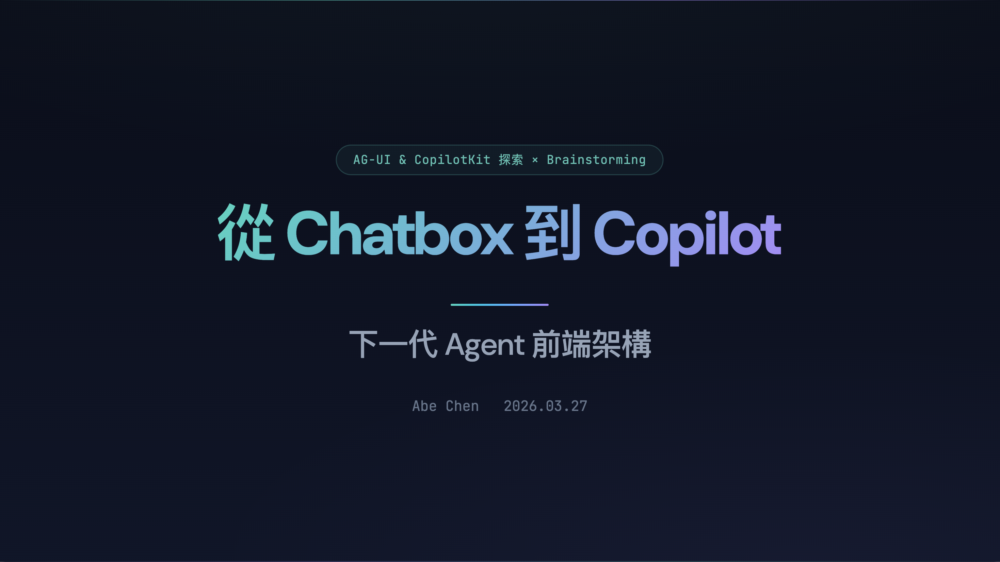

# 從 Chatbox 到 Copilot



> 下一代 Agent 前端架構 — AG-UI & CopilotKit 探索 × Brainstorming

Team Brainstorm 簡報，使用 [Slidev](https://sli.dev) 製作。

## 內容大綱

1. AG-UI 基礎概念與 Protocol Triangle（MCP / A2A / AG-UI）
2. REST API vs Agent API 差異
3. SSE 事件生命週期
4. CopilotKit React SDK 功能總覽
5. Generative UI 三種模式（Controlled / Declarative / Open-ended）
6. 市場應用案例
7. 前後端實戰整合（React + FastAPI）
8. 架構全景圖
9. Open Brainstorm

## 開始使用

```bash
pnpm install
pnpm dev
```

瀏覽器開啟 http://localhost:3030

## 匯出 PDF

```bash
pnpm export
```

需要先安裝 `playwright-chromium`（已在 devDependencies）。

## 相關資源

- [AG-UI Protocol](https://docs.ag-ui.com)
- [CopilotKit](https://www.copilotkit.ai)
- [CopilotKit Examples](https://www.copilotkit.ai/examples)
- [AG-UI Dojo (Demo)](https://dojo.ag-ui.com)
- [JSON Render (Declarative UI)](https://json-render.dev)
